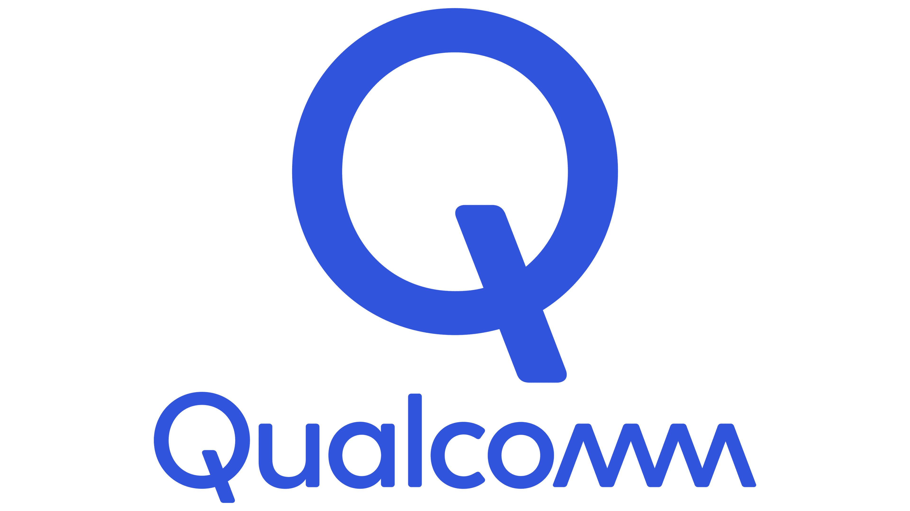

  

### Overview

The integration of foundation models, large language models (LLMs), vision-language models (VLMs), and advanced 3D perception into intelligent vehicle and autonomous driving (AD) systems is transforming the field. 
Foundation models, built on architectures with significant capacity, leverage vast datasets through self-learning approaches to achieve remarkable performance across diverse tasks and domains. 
Models such as DALL-E, CLIP, and SAM are paving the way for new research directions, particularly in traffic safety and cooperative autonomous systems.
This workshop aims to unite researchers from diverse backgrounds to explore the potential of these technologies in enhancing perception accuracy, dataset curation, novelty detection, planning, and control for IV and AD systems. 
Topics of interest include 3D object detection, semantic segmentation, sensor fusion, V2X communication, and cooperative perception. 
The application of foundation models in AD also enables efficient utilization of large-scale, multi-modal sensor data, addressing challenges such as costly manual annotation, multi-sensor modality integration, and the spatial-temporal nature of data.
Moreover, the workshop will address critical issues such as computational resource constraints and the need for safety assurance in AD platforms. 
By fostering collaboration between vision-language researchers and AD experts, this workshop seeks to unlock innovative solutions for intelligent transportation, leveraging the rapid development of foundation models and their applications.
The goal is to create a dynamic forum for discussing how emerging technologies can be adapted to overcome existing challenges and create novel capabilities in intelligent vehicle systems and cooperative autonomous driving.

### TOPICS

We enthusiastically invite submissions that focus on recent breakthroughs in the research and development of DLIVA, coupled with their real-world applications. Contributions in the form of theory, methodology, and application papers are encouraged from areas **including but not limited to**:

**3D Object Detection & Tracking**\
• Semantic Segmentation\
• 3D Occupancy Prediction\
• Perception with Roadside Sensors\
• Cross 3D Sensor Set Knowledge Distillation\
• Closed-loop neural simulation for 3D perception and planning\
• V2X Communication\
• Vehicle-Infrastructure Fusion\
• Intelligent Transportation Systems\
• Multi-modal Sensor Data Fusion\
• Multi-Agent Interactions

**Foundation Models**\
• LLM-assisted Perception & Prediction\
• Vision-Language Models\
• FMs for Dataset Curation & Labeling\
• FMs for Accident & Novelty Detection\
• Intelligent Vehicle Dataset Curation\
• Machine Learning and Explainability\
• Interpretability and Trust\
• Representation Learning\
• Domain Adaptation\
• Simulation, Validation, and Safety with VLMs\
• Trends in model architectures\
• Adaptation to AD sensor modalities\
• Usage of large data sources\
• Self-learning methods for AD\
• Identification of AD tasks\
• Deployment strategies

The relevant topics are not confined to those listed above. 
We welcome all contributions that are pertinent to the Intelligent Vehicles community, with a focus on developing, iterating, and maintaining data to drive its advancement and help build better algorithms.

### Submission Details

We welcome submissions of papers ranging from 4 to 8 pages as main content, with up to 2 additional pages containing references and an optional appendix. 
All submissions must be in PDF format and formatted according to the IEEE format (e.g., using the [IEEE LaTeX template](http://its.papercept.net/conferences/support/tex.php#latexclass). 
Following the IV'25 conference submission policy, reviews are single-blind, and author names and affiliations will be visible. 
Submitted works will be assessed based on their novelty, technical quality, potential impact, and clarity of writing (and should be in English). 
For papers that primarily rely on empirical evaluations, the experimental settings and results should be clearly presented and repeatable. 
We encourage authors to make data and code available publicly when possible.

**Accepted papers will be posted on this workshop website. By default, accepted papers will be published in the IV'25 conference proceedings.**

The best paper (according to the reviewers' ratings and organizing committee) will be announced at the end of the workshop.

All submissions must be uploaded electronically via the [papercept submission website](https://its.papercept.net/conferences/scripts/start.pl).

Use the following code to submit your paper to the workshop: [**DataDrivenLearningIV**](https://ieee-iv.org/2025/wp-content/uploads/sites/3/2025/01/Workshops_IV_ok.pdf)

At least one of the authors of the accepted workshop papers must register for the workshop and be present on the day of the workshop.

For questions regarding submissions, please contact us.

### Important Dates

<table>
  <tr>
    <td><s>Workshop Paper Submission Deadline I (published in proceedings):</s></td>
    <td><b><s>February 1, 2025</s></b></td>
  </tr>
  <tr>
    <td>Workshop Concept Paper Submission Deadline II (not published): </td>
    <td><b><s>March 15, 2025</s></b></td>
  </tr>
  <tr>
    <td>Workshop paper notification:</td>
    <td><b><s>March 30, 2025</s></b></td>
  </tr>
  <tr>
    <td>Workshop paper final submission: </td>
    <td><b><s>April 25, 2025</s></b></td>
  </tr>
  <tr>
    <td>Workshop date: </td>
    <td><b>June 22, 2025</b></td>
  </tr>
</table>

All submission deadlines are end-of-day in the **Pacific Time Zone**.

### Sponsors

We sincerely thank Qualcomm Inc. for their generous sponsorship of our workshop. Their support enables us to recognize outstanding research through prestigious awards. 

  

We are currently seeking sponsorship opportunities and would be delighted to discuss potential collaborations. Interested parties are kindly requested to contact us via email at walter.zimmer@cs.tum.edu for further details.
